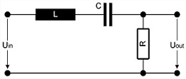
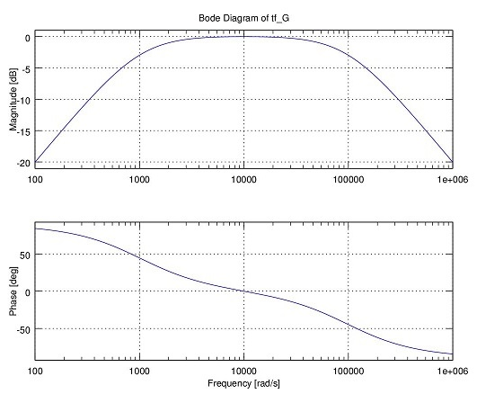

linNet, the Software for symbolic Analysis of linear Electronic Circuits
========================================================================

linNet is an application to compute the transfer function of linear,
electronic circuits. The computation is done symbolically, not
numerically, and the result is a formula rather than a number or a series
of such. The found formula is the Laplace transform of the dependencies of
the voltages and currents in the circuit on the input voltages and
currents.

A linear electronic circuit is a combination of the supported basic
devices as listed in the table below. The circuit is input to linNet. The
representation of the circuit is a list of devices with connectivity
information. The interconnections are expressed by references to nodes,
where a node is a point of the circuit, which normally at least two
devices are connected to. This leads to a simple formal syntax, the
circuit network list or simply netlist. This list can be created and
maintained with a text editor; there's no graphical interface for editing
a circuit.

The computed formulas are printed to the console and to the application
log file and can be used for further investigation or for publications or
didactic purpose.

<table>
  <caption>Table 1: Supported linear devices</caption>
  <tr>
    <td><b>Device</b></th>
    <td><b>Symbol</b></th>
  </tr>
  <tr><td>Resistor                            </td>  <td>R     </td></tr>
  <tr><td>Conductance                         </td>  <td>Y     </td></tr>
  <tr><td>Capacitor                           </td>  <td>C     </td></tr>
  <tr><td>Inductivity                         </td>  <td>L     </td></tr>
  <tr><td>Ideal operational amplifier (op-amp)</td>  <td>OP    </td></tr>
  <tr><td>Constant voltage source             </td>  <td>U     </td></tr>
  <tr><td>Voltage controlled voltage source   </td>  <td>U(U)  </td></tr>
  <tr><td>Current controlled voltage source   </td>  <td>U(I)  </td></tr>
  <tr><td>Constant current source             </td>  <td>I     </td></tr>
  <tr><td>Voltage controlled current source   </td>  <td>I(U)  </td></tr>
  <tr><td>Current controlled current source   </td>  <td>I(I)  </td></tr>
  <tr><td>Current probe (wire)                </td>  <td>PI    </td></tr>
</table>

To make the application somewhat more attractive it exports the computed
formulas as Octave or MATLAB script code, too. Numeric evaluation becomes
a simple one-line command in Octave. The formulas are exported as LTI
transfer function objects so that the complete set of analysis functions
from the Octave control toolbox can be applied just like that. This
reaches from simple transfer function plotting to stability analyses and
system response computation on arbitrary system input.

*Figure 1: Simple example of a linear electronic circuit*

Please refer to figure 1 as an example of how linNet works. This is a
simple RLC element with a transfer function of second order. It can be
represented by the following circuit netlist:

    U Uin in  gnd
    L L   in  K1
    C C   K1  out
    R R   out gnd
    PLOT G U_out U_in

Given this was put into file rlc.cnl, then we can run linNet:

    linNet -o rlc.cnl

and would yield the output:

    User-defined result G (Bode plot):
    The dependency of U_out on U_in:
      U_out(s) = N_U_out_U_in(s)/D_U_out_U_in(s) * U_in(s), with
        N_U_out_U_in(s) = R*C * s
        D_U_out_U_in(s) = L*C * s^2
                          +R*C * s
                          +1

Going to Octave and typing G to plot the transfer function (still using
default device values) gives us a nice Bode plot of the transfer function;
please refer to figure 2. More plots or plots with altered device values
are a matter of single commands in Octave.

*Figure 2: Octave plot using the linNet generated LTI object*

You will find the details of the usage of linNet, in particular
installation, netlist syntax and Octave interface and an explanation of
the mathematical concept of the software in the user guide
[linNet-userGuide.pdf](linNet-userGuide.pdf "linNet manual"), located here
at GitHub for reference.

The source code of linNet is hosted at SourceForge; please see
<https://sourceforge.net/projects/linnet-svn/>. There, you will also find
download buttons for ready-to-use distributions with manual, samples and
executable binaries for Windows and Linux. Mac users will have to compile
the software, the makefile and source code files are prepared to do so.

linNet means "linear network". It founds on a symbolic solver for
linear equation systems. There's no way to model any non linear effects
like noise, voltage or current limits, non-linear distortions or switching
operations. All of these effects play an important role in real electronic
circuits and a good deal even uses these effects as their principle of
operation - you won't find linNet helpful for an investigation of
these kind of effects or circuits. There are many numeric circuit
simulation tools, which are capable to do this, in the first place the
popular open source tool SPICE with all its derivates. linNet is
conceptually not a competitor of these tools, although it can behave a
tiny bit alike when using Octave as numeric post-processor. linNet is
not the worse SPICE, linNet is different.
